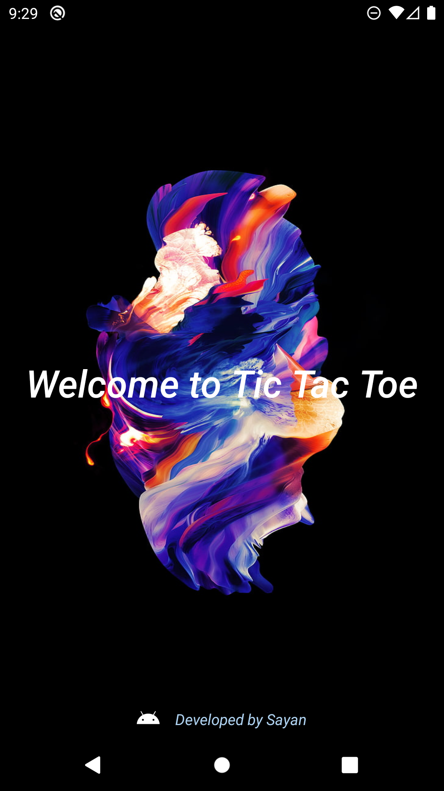
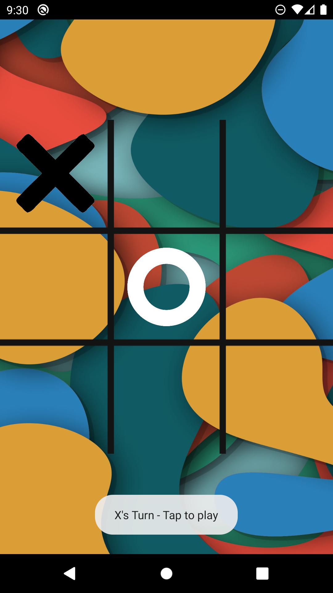
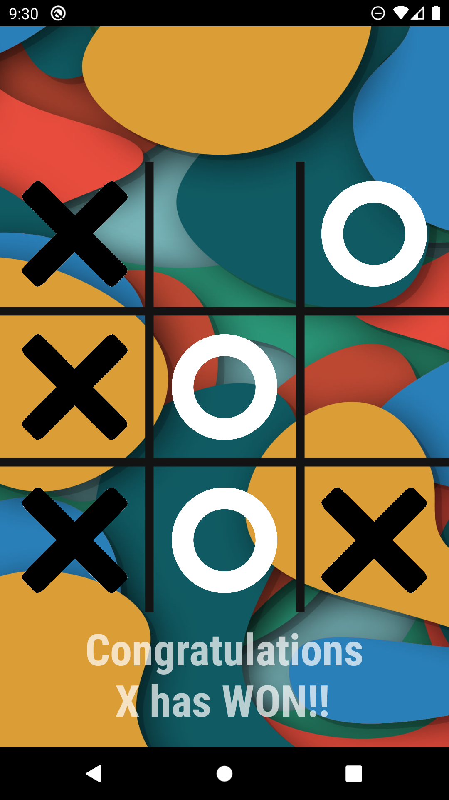
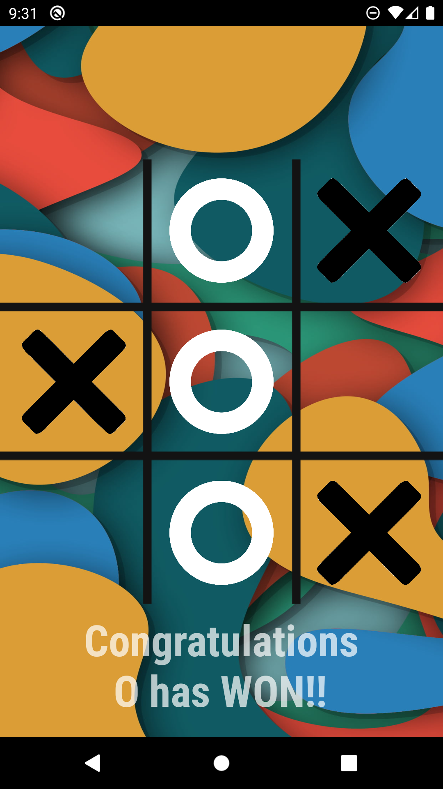
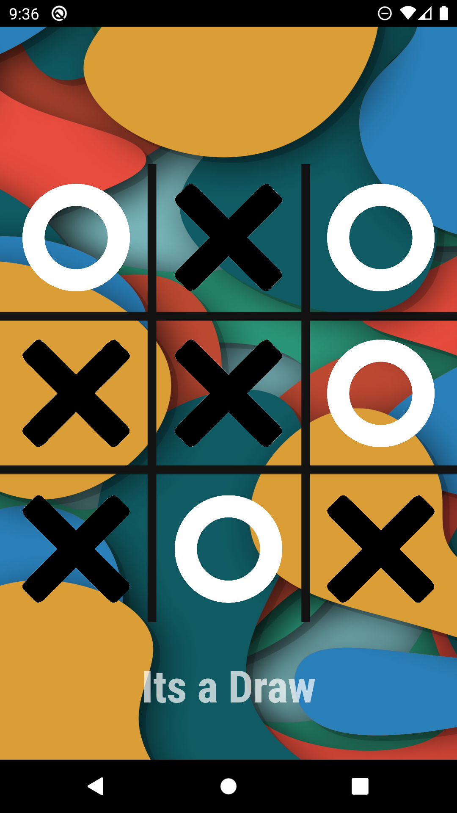

  

# Overview
An android simulation of the classic game of Tic-Tac-Toe. 

# Screenshots

  
  
  
  
  

# Key Features
Intuitive User Interface: Easy-to-navigate screens with a clean and interactive board design.

# Technologies used
- ConstraintLayout
- LinearLayout
